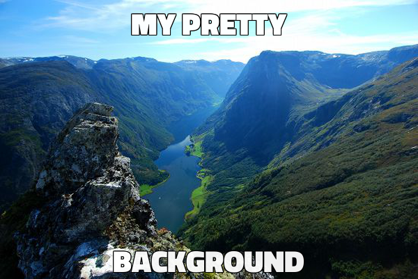

# Memegen

An API to programatically generate memes based solely on requested URLs.

 

> :warning: **This project is in maintinence mode**. See [jacebrowning/memegen](https://github.com/jacebrowning/memegen) for active development.

<!--content-->

## Generating Images

The API is stateless so URLs contain all the information necessary to generate meme images. For example, http://localhost:5000/buzz/memes/memes_everywhere.jpg produces:

But, the site can also produce masked URLs to conceal the joke:

http://localhost:5000/_YnV6egltZW1lcy9tZW1lcy1ldmVyeXdoZXJl.jpg

For any image, lose the extension to see a list of all format options:

http://localhost:5000/buzz/memes/memes_everywhere

### Special Characters

In URLs, spaces can be inserted using underscores, dashes, or mixed case:

* underscore (`_`) → space (` `)
* dash (`-`) → space (` `)
* 2 underscores (`__`) → underscore (`_`)
* 2 dashes (`--`) → dash (`-`)
* "weLoveMemes" → "we love memes"

Reserved URL characters can be escaped:

* tilde + Q (`~q`) → question mark (`?`)
* tilde + P (`~p`) → percentage (`%`)
* tilde + H (`~h`) → hashtag/pound (`#`)
* tilde + S (`~s`) → slash (`/`)
* 2 single qutoes (`''`) → double quote (`"`)

For example, http://localhost:5000/doge/~hspecial_characters~q/underscore__-dash--.jpg produces:

### Alternate Styles

Some memes come in multiple forms, which can be selected via `?alt=<style>`:

For example: [http://localhost:5000/sad-biden/sad_joe_biden/doesn't_think_you'll_vote.jpg?alt=scowl](http://localhost:5000/sad-biden/sad_joe_biden/doesn't_think_you'll_vote.jpg?alt=scowl)

Or, you can use your own image URL as the style. For example, http://localhost:5000/custom/my_pretty/background.jpg?alt=http://www.gstatic.com/webp/gallery/1.jpg produces:

### Alternate Fonts

Additional fonts are available (see: http://localhost:5000/api/fonts) and can be selected via `?font=<name>`.

For example, http://localhost:5000/joker/pick_a_different_font/people_lose_their_minds.jpg?font=typoline-demo produces:

### Custom sizes

Images can be scaled to a specific width via `?width=<int>` or a specific height via `?height=<int>`. If both parameters are provided (`?width=<int>&height=<int>`), the image will be padded to the exact dimensions.

For example, http://localhost:5000/both/width_or_height/why_not_both~q.jpg?height=350&width=600 produces:

### Preview Images

API clients that want to show a preview of an image while the user is still typing should disable caching and analytics via `?preview=true`.

### Social Media

Add `?share=true` to get HTML with images optimized for sharing on social media.

## Adding Templates

To add a new template, please follow the [contributor instructions](CONTRIBUTING.md).

Thanks go to [danieldiekmeier/memegenerator](https://github.com/danieldiekmeier/memegenerator) for the inspiration!

## Sample Clients

| Platforms | Link | Source |
| :-: | :-- | :-- |
| Slack | --- | Python: [nicolewhite/slack-meme](https://github.com/nicolewhite/slack-meme) | --- |
| Slack | --- | Go: [CptSpaceToaster/slackbot](https://github.com/CptSpaceToaster/slackbot) | --- |
| Slack | http://www.memetizer.com | --- |
| Hain | --- | JavaScript: [Metrakit/hain-plugin-meme](https://github.com/Metrakit/hain-plugin-meme) |
| Web | ---| Clojure: [jasich/mighty-fine-memes](https://github.com/jasich/mighty-fine-memes) |
| Web, Slack | https://memecomplete.com | --- |

Additional clients can be found by searching for [code examples on GitHub](https://github.com/search?o=desc&q=%22memegen.link%22+&ref=searchresults&s=indexed&type=Code&utf8=%E2%9C%93).
